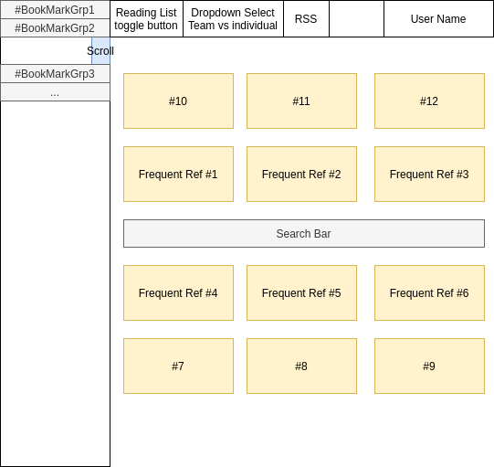

# BookmarkItApp
ReactJS and Spring Boot bookmarking app

This application sets out to simplify and enrich many of the features that other applications 
have and combine and rethink those features into a easy UI/UX experience for users.

# Features 
<details>
  <summary>Click to expand!</summary>

## Easy Searching
For example when the user arrives to the page they will have a search bar that is right at the top ready for user to immediately begin doing
full context page searches. 

## Quick Reference
This section shows the bookmarks that are frequently referenced. 

## Team Knowledgebase
In this section the bookmarks become the welcome page for new member to share team knowledge that is relevant to the team.

## RSS Feed from bookmarked sites
Many of the sites a user bookmarks they may also want an RSS feed from, this solves two problems at once.

## Reading list
A hit list of read laters. 

## And more to come!
</details>

# Running the Application 
<details>
  <summary>Click to expand!</summary>

Docker: 
```
docker compose up
```

On the commandline: 
````
cd client; npm run serve
# create a new tab/terminal
cd server; ./gradlew bootRun
````

default user: 
`user:user password:password`

</details>

# Design
<details>
  <summary>Click to expand!</summary>


</details>
