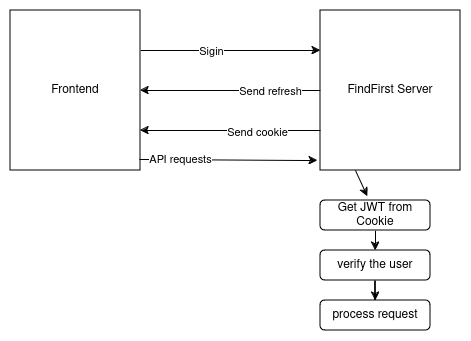

# Architecture overview

## Server
- User registration.
- Communication with DB.
- Handle requests for Bookmarks.

## Frontend
- Interface to make requests to backend.

## DB
- User accounts
- User bookmarks, tags, etc
